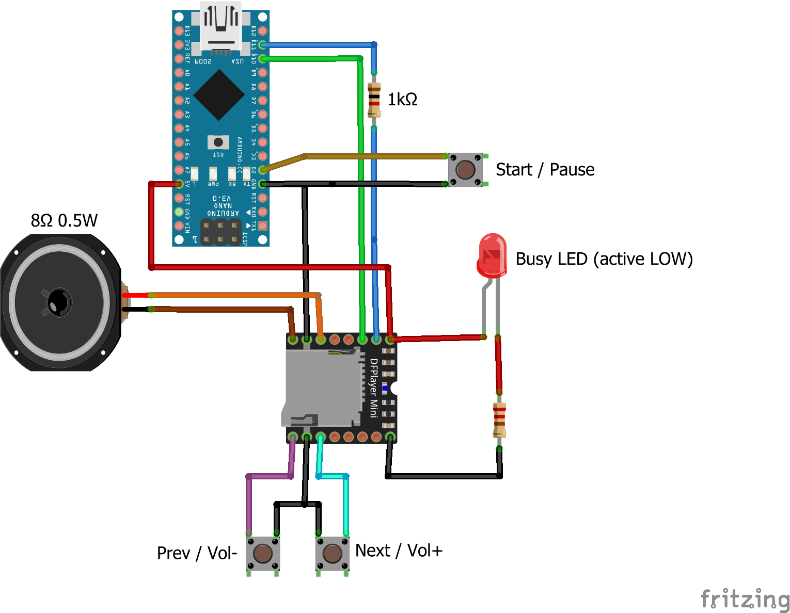
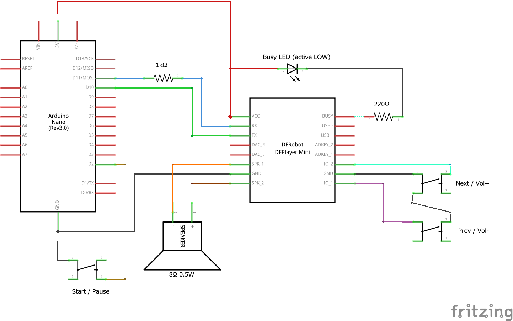
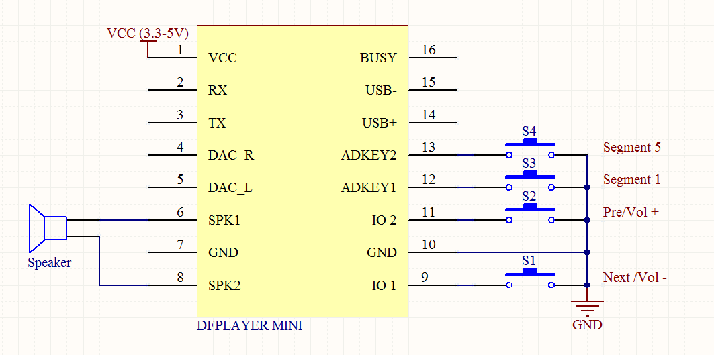

# Arduino Music Player

An Arduino-based device that can play MP3 files from a microSD card.

## Features

- Play MP3 files from microSD card.
- Go to next and previous songs with single press.
- Increase and decrease volume level with long press.
- Pause and resume the currently played song with double press.
- LED that indicates when a song is played.

## Parts List

- 1x Arduino Nano
- 1x DFRobot's [DFPlayer Mini](https://wiki.dfrobot.com/DFPlayer_Mini_SKU_DFR0299) board
- 1x 8Ω 0.5W speaker - according to the specs DFPlayer can direct drive a 4/8Ω 3W speaker
- 3x button
- 1x 220Ω resistor
- 1x 1kΩ resistor - required because the Arduino is 5V, but the DFPlayer is 3.3V
- 1x microSD card - maximum 32GB formatted to FAT32
- 1x LED
- wires

## Wiring

## Feature Highlights

### DFPlayer Communication

DFPlayer has a serial protocol, so we are using the Arduino [SoftwareSerial](https://www.arduino.cc/en/Reference/softwareSerial) library to use pin 11 and 10 as TX and RX ports. The low level protocol is documented in the module's [datasheet](./doc/FN-M16P+Embedded+MP3+Audio+Module+Datasheet.pdf).

Although there are newer libraries (like [DFPlayerMini_Fast](https://github.com/PowerBroker2/DFPlayerMini_Fast)) I used DFRobot's [DFRobotDFPlayerMini](https://github.com/DFRobot/DFRobotDFPlayerMini) library to wrap the low level serial details. The best documentation of this library is the [FullFunction example](https://github.com/DFRobot/DFRobotDFPlayerMini/blob/master/examples/FullFunction/FullFunction.ino).

### MP3 Files

Section 1.4 in the [datasheet](./doc/FN-M16P+Embedded+MP3+Audio+Module+Datasheet.pdf) describes how the files should be named on the SD card. Basically you have to create an `mp3` folder in the root and name your files `0001.mp3`, `0002.mp3` and so on.

**Important!** The order of the files is not determined by their name, but by the order they are written to the SD card! The best approach is to name the files on your computer and then copy them to the SD card. 

The SD card must be formatted to FAT32 and in my experience it must have only a single partition.

I downloaded several files from https://www.101soundboards.com and they all worked with DFPlayer.

### Buttons

According to the documentation the `IO1` and `IO2` pins can be used to control volume level and to navigate between the songs.

Short press means playing the next and previous songs, long press means increasing and decreasing the volume level.

In my experience the **documentation is not correct**: `IO2` has the `Next/Vol+` functionality and `IO1` has `Pre/Vol-`.

Although the `ADKEY` pins could be used to add more buttons, I decided to control play/pause from software, so I connected a button to the Arduino and used [Matthias Hertel's OneButton library](https://github.com/mathertel/OneButton) so I didn't have to deal with debouncing the button and I could easily add support for  double press.

### Busy LED

DFPlayer's `BUSY` pin goes `LOW` when a song is being played and goes `HIGH` when the device is in idle state, so I added a LED that works in sync with the onboard LED.

From code the `player.available()` function behaves similarly.

## About the author

This project was created by [György Balássy](https://linkedin.com/in/balassy).